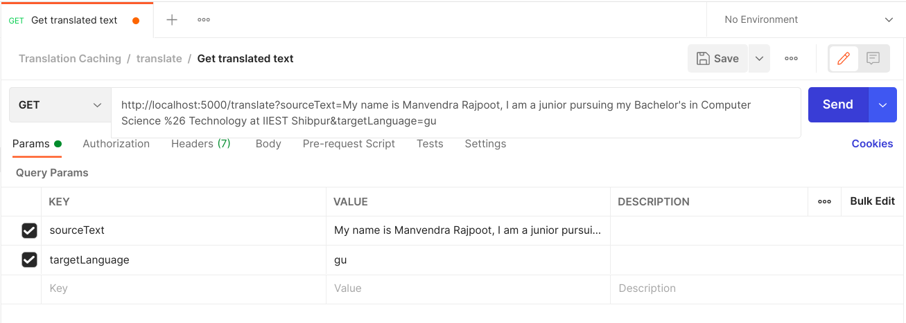

# Translation Caching

### Goal
- A web server that exposes an API to translate a text.

### Task
- Create a web server with a RESTful API to translate a text from one language to another.
- For the actual translation, an external service like Google Translate can be used.
- The source and target language should be definable via the API.
- In addition, cache (store in Database) translations, in order to avoid repeated hits to the translation API. The
cache must be persistent!
- The server should have an extensible architecture. 
E.g. We may want to change our caching strategy or switch out our
translation service.

### Tech stack used
-  `NodeJS` & `ExpressJS` (a flexible Node.js web application framework) as beckend.
-  `node-cache` package for caching.
-  `Jest` to test the APIs.

## Install Dependencies

```
npm install
```

## Run the app
```
# Run in development mode
npm run devStart

# Run in production mode
npm start
```

## Usage 
To get the translation, we can Postman or any web browser and hit this API as follow:
```
{URL}/translate?sourceText=&targetLanguage=''

# URL: (http://localhost:5000) or Deployed link
```

We have to pass two `Query Params` with 
```
 _____________________________________
|_______KEY_______|_______VALUE_______|
|                 |                   |
| sourceText      |        _          |
|-----------------|-------------------|
| targetLanguage  |        _          |
|_________________|___________________|
```
- `sourceText`: the text you want to translate
- `targetLanguage`: the langauge to be it has to be translated
<br>**NOTE:**
  - for the `targetLangauge`, only **ISO Language code** should be passed as value.
<br/>For example:
    - "hi" for Hindi
    - "ja" for Japanese
    - "fa" for Persian, etc.
    <br/>A list of all [ISO Language Codes](https://datahub.io/core/language-codes/r/0.html) is attached here.

- A sample example is shown here when we hit the route on Postman.


-Same thing can be done on any web browser by hitting the `GET` request.

## Caching 
In order to avoid repeated hits to the translation API, caching of translation is done.

If the HTTP method is `GET` then we cache the translation.
first time when a unique request is made it will take actual time to fetch the response. After that it get stored in cached for some time(here in this project I use 10 seconds but can be modified as need.). Now after each time if same request is made it will get fetched from cached translation.

For this I use `node-cache` npm package.

## Testing
Testing on our REST API is done using `jest` along with `supertest`(which provide less complex structure to handle request.)

Test cases where written to provide whether the the request return statusCode as **200**.

- To test the APIs.
  ```
  # Test during development mode
  npm run jest:watch

  # Test once on hitting this command
  npm jest
  ```


- Version: 1.0.0
- Lisence: MIT